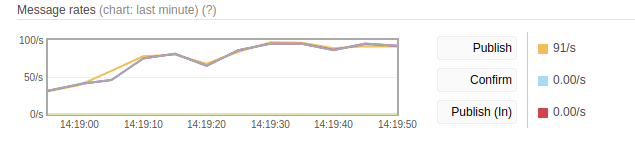

# MQ-benchmark

Benchmarks of MQ services for microservice projects


### AMQP

Ping: 15,420/s
Pong: 15,428/s
Correlation: 1:1



##### Props

+ We used it
+ Clusterization
+ Federation
+ UI
+ Durable

### NATS

##### Pub/Sub

Ping: 50,000+/s
Pong: 50,000+/s
Correlation: 1:1

##### Request/Pepley

Ping: 50,000+/s
Pong: 50,000+/s
Correlation: 1:1

##### Props

+ Pub/Sub
+ Request/Pepley

### NATS Streaming

###### `Starting benchmark [msgs=1000000, msgsize=128, pubs=1, subs=0]`

```
Pub stats: 4,837 msgs/sec ~ 604.70 KB/sec
```

###### `Starting benchmark [msgs=100000, msgsize=128, pubs=0, subs=1]`

```
Sub stats: 263,726 msgs/sec ~ 32.19 MB/sec
```

###### `Starting benchmark [msgs=1000000, msgsize=4, pubs=1, subs=0]`

```
Pub stats: 4,970 msgs/sec ~ 19.42 KB/sec
```

###### `Starting benchmark [msgs=1000000, msgsize=128, pubs=10, subs=0]`

```
Pub stats: 19,528 msgs/sec ~ 2.38 MB/sec
 [1] 1,956 msgs/sec ~ 244.51 KB/sec (100000 msgs)
 [2] 1,955 msgs/sec ~ 244.49 KB/sec (100000 msgs)
 [3] 1,955 msgs/sec ~ 244.47 KB/sec (100000 msgs)
 [4] 1,955 msgs/sec ~ 244.47 KB/sec (100000 msgs)
 [5] 1,955 msgs/sec ~ 244.40 KB/sec (100000 msgs)
 [6] 1,954 msgs/sec ~ 244.37 KB/sec (100000 msgs)
 [7] 1,954 msgs/sec ~ 244.26 KB/sec (100000 msgs)
 [8] 1,953 msgs/sec ~ 244.18 KB/sec (100000 msgs)
 [9] 1,953 msgs/sec ~ 244.15 KB/sec (100000 msgs)
 [10] 1,952 msgs/sec ~ 244.11 KB/sec (100000 msgs)
 min 1,952 | avg 1,954 | max 1,956 | stddev 1 msgs
```

###### `Starting benchmark [msgs=1000000, msgsize=128, pubs=100, subs=0]`

```
Pub stats: 29,505 msgs/sec ~ 3.60 MB/sec
```

###### `Starting benchmark [msgs=1000000, msgsize=128, pubs=10, subs=10]`

```
NATS Streaming Pub/Sub stats: 143,090 msgs/sec ~ 17.47 MB/sec
 Pub stats: 13,035 msgs/sec ~ 1.59 MB/sec
  [1] 1,345 msgs/sec ~ 168.18 KB/sec (100000 msgs)
  [2] 1,327 msgs/sec ~ 165.89 KB/sec (100000 msgs)
  [3] 1,326 msgs/sec ~ 165.87 KB/sec (100000 msgs)
  [4] 1,326 msgs/sec ~ 165.80 KB/sec (100000 msgs)
  [5] 1,317 msgs/sec ~ 164.73 KB/sec (100000 msgs)
  [6] 1,313 msgs/sec ~ 164.16 KB/sec (100000 msgs)
  [7] 1,311 msgs/sec ~ 163.88 KB/sec (100000 msgs)
  [8] 1,310 msgs/sec ~ 163.80 KB/sec (100000 msgs)
  [9] 1,310 msgs/sec ~ 163.75 KB/sec (100000 msgs)
  [10] 1,303 msgs/sec ~ 162.99 KB/sec (100000 msgs)
  min 1,303 | avg 1,318 | max 1,345 | stddev 11 msgs
 Sub stats: 384,791 msgs/sec ~ 46.97 MB/sec
  [1] 39,592 msgs/sec ~ 4.83 MB/sec (1000003 msgs)
  [2] 39,229 msgs/sec ~ 4.79 MB/sec (1000003 msgs)
  [3] 39,171 msgs/sec ~ 4.78 MB/sec (1000003 msgs)
  [4] 38,724 msgs/sec ~ 4.73 MB/sec (1000003 msgs)
  [5] 38,660 msgs/sec ~ 4.72 MB/sec (1000003 msgs)
  [6] 38,595 msgs/sec ~ 4.71 MB/sec (1000003 msgs)
  [7] 38,608 msgs/sec ~ 4.71 MB/sec (1000003 msgs)
  [8] 38,590 msgs/sec ~ 4.71 MB/sec (1000003 msgs)
  [9] 38,567 msgs/sec ~ 4.71 MB/sec (1000003 msgs)
  [10] 38,531 msgs/sec ~ 4.70 MB/sec (1000002 msgs)
  min 38,531 | avg 38,826 | max 39,592 | stddev 348 msgs
```

##### Props

+ ASK
+ Speed limit
+ Durable

### NSQ

```
Publish ~5.000 (1 instance)
Publish ~35.000 (3 instance)
Subscribe 30.000+ (1 instance, 10 gourutines)
```

###### Official

```
# using --mem-queue-size=1000000 --data-path= --size=200 --batch-size=200
PUB: [bench_writer] 2018/10/03 17:30:50 duration: 10.142364618s - 4.664mb/s - 24451.892ops/s - 40.897us/op
SUB: [bench_reader] 2018/10/03 17:31:00 duration: 10.078608328s - 4.693mb/s - 24606.572ops/s - 40.640us/op
```

```
# using --mem-queue-size=1000000 --data-path= --size=4 --batch-size=200
PUB: [bench_writer] 2018/10/03 17:34:35 duration: 10.004104975s - 0.134mb/s - 35245.532ops/s - 28.372us/op
SUB: [bench_reader] 2018/10/03 17:34:45 duration: 10.044196769s - 0.134mb/s - 35120.081ops/s - 28.474us/op
```

### gRPC

```
./run_bench.sh -c 1 -req 4
qps: 5920.2
Latency: (50/90/99 %ile): 163.26µs/194.137µs/284.877µs
Client CPU utilization: 17.196106652s
Server CPU utilization: 19.055712769s
```

```
./run_bench.sh -c 10 -req 4
qps: 28674.7
Latency: (50/90/99 %ile): 289.996µs/468.852µs/1.511479ms
Client CPU utilization: 32.523916725s
Server CPU utilization: 36.774488391s
```

```
./run_bench.sh -c 10 -req 200
qps: 25125.1
Latency: (50/90/99 %ile): 317.85µs/566.331µs/1.946365ms
Client CPU utilization: 30.203881793s
Client Mem Profile: /tmp/client_r_1_c_10_req_200_resp_1_unary_1538578093.mem
Server CPU utilization: 34.315704453s
```

```
./run_bench.sh -c 10 -req 200 -rpc_type streaming
qps: 63071.5
Latency: (50/90/99 %ile): 132.782µs/214.27µs/628.471µs
Client CPU utilization: 35.75503333s
Server CPU utilization: 34.555893605s
```